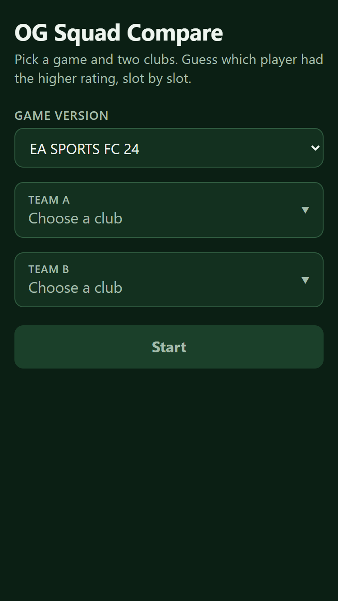
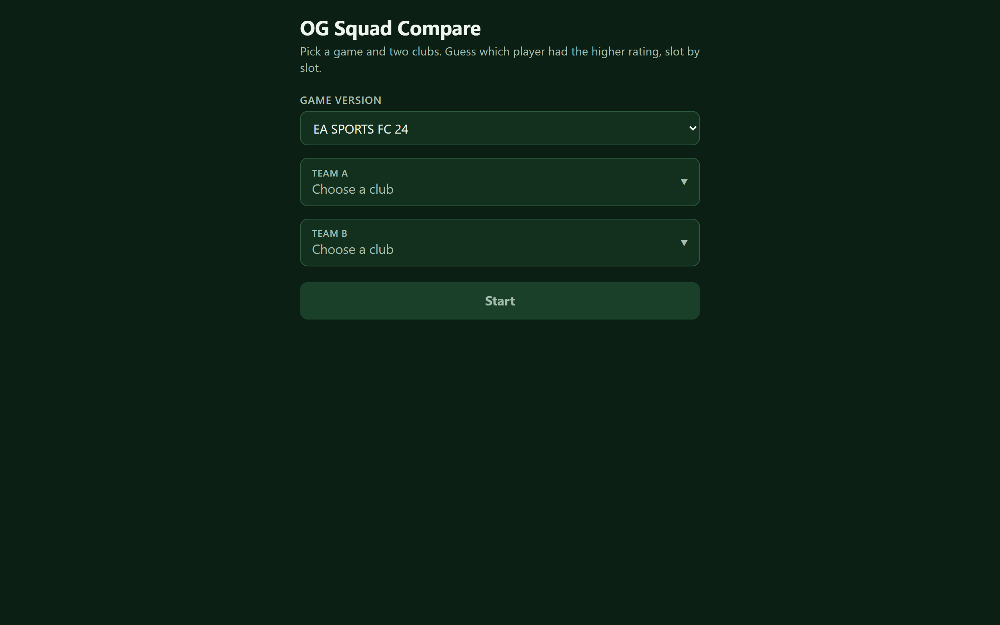
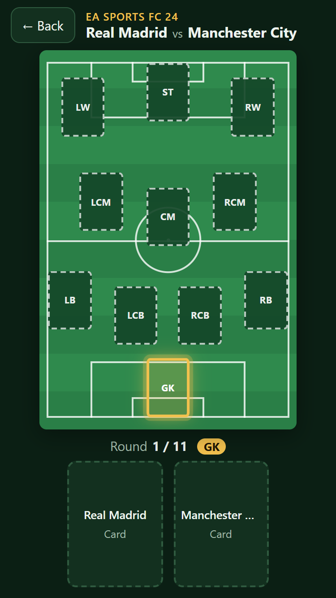
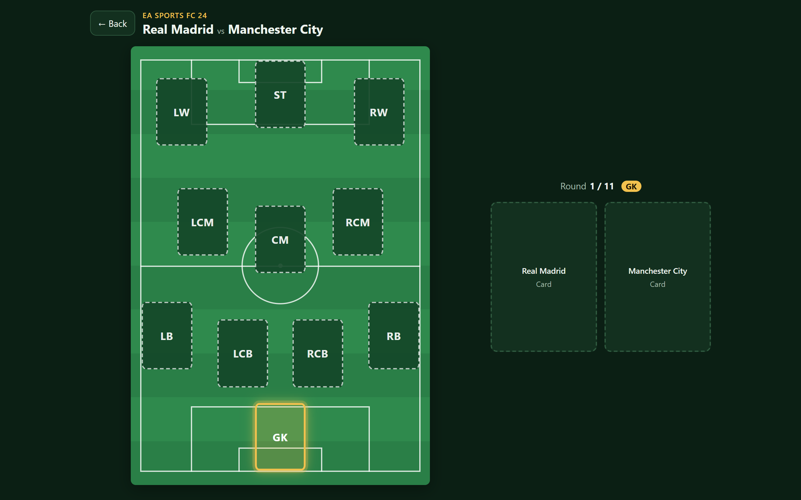

# Stage 04 report — App skeleton

## What was done

- **Environment:** Node **v22.19.0** and npm 10.9.3 on this machine (Windows 11).
- **Scaffold:** I generated the app with `npm create vite@latest -- --template react-ts` in a scratch folder, then
  copied it into `app/`, because `app/` already held `public/data/`. That data is untouched.
  - Versions: Vite 8.3, React 19.2, TypeScript 6.0 and oxlint 1.8x. oxlint is the template's default linter.
  - `strict: true` is set in both tsconfigs; the template does not set it. `vite.config.ts` uses `base: './'` (D27).
  - I removed the template demo assets (logos and hero image) and added a small SVG favicon of a pitch.
- **Scripts** (`app/package.json`):
  - `dev` runs `vite`.
  - `build` runs `tsc -b && vite build`.
  - `preview` runs `vite preview`.
  - `test` runs `vitest run` (Vitest 5.0, D28).
  - `lint` runs `oxlint --deny-warnings`, so warnings also fail the lint.
- **Data layer** (`app/src/data/`):
  - `types.ts` mirrors `versions.json` and `<v>/teams.json`. It covers:
    - a `Slot` union, plus unions for `Position` (the 15 `player_positions` codes) and `EaPosition` (27 codes plus
      SUB/RES);
    - `XiPlayer = GoalkeeperPlayer | OutfieldPlayer`, where a goalkeeper has `slot: 'GK'` and `gk`, and an outfield
      player has an outfield slot and `stats`. The other block is typed `never`.
  - `loaders.ts` fetches relative to `import.meta.env.BASE_URL` and caches one promise per version. A failed request
    is removed from the cache, so a retry fetches again. Errors surface as `DataLoadError` with a readable message,
    e.g. "Could not load the clubs for this version (HTTP 404)."
  - `useData.ts` provides the `useVersions()` and `useTeams(version)` hooks. They return
    `idle | loading | error | ready` plus `retry()`, and ignore stale responses after a version switch.
- **Screens.** `App.tsx` is a two-state machine, `setup | game`.
  - **Setup:**
    - The version `<select>` lists versions newest first; the default is the newest (FC 24).
    - There are two club pickers, "Team A" and "Team B". Each is a button that expands a panel with a search
      field and a list of clubs grouped by league. League order and names come from `versions.json`, and clubs are
      alphabetical within a league.
    - Search ignores case and accents, so "munchen" finds "FC Bayern München".
    - The club picked on the other side is disabled and labelled "Team A" or "Team B". Escape closes the panel.
    - Changing the version clears both picks. "Start" is enabled only when two different clubs are picked.
  - **Game (skeleton):**
    - The header shows the version label, "Team A vs Team B" and a Back button. Back keeps the picks.
    - The pitch is vertical and drawn in CSS (D29), with stripes, outline, halfway line, centre circle and spot,
      and penalty and goal boxes. It has 11 dashed, card-shaped placeholders labelled with their slot codes.
      GK is highlighted as the current round (D8) with `aria-current="step"`.
    - The guess area shows "Round 1 / 11" with the slot code and two placeholder card boxes named after the clubs.
  - **Loading and error states:** a full-screen state covers `versions.json`, and an inline state inside the
    setup screen covers `teams.json`. Both have a "Try again" button.
- **Layout:**
  - Mobile first. The game screen is exactly one viewport tall (`100dvh`) and the pitch is sized with container
    query units: `width: min(100cqw, 68cqh)` with a 68:100 aspect ratio. The pitch therefore always fits between
    the header and the guess area without scrolling.
  - From 52 rem (832 px) wide, the guess area sits to the right of the pitch, and the whole board is capped at
    62 rem and centred.
  - Only real `<button>`, `<label>`, `<select>` and `<input>` elements are used. There is a global
    `:focus-visible` outline in the accent colour, and a `visually-hidden` helper provides screen-reader text.
- **Tests** (13, all passing):
  - `lib/teams.test.ts`: grouping, league order, accent-insensitive search and sorting versions.
  - `game/slots.test.ts`: slot and round order (D8), and the vertical layout (D29).
  - `data/loaders.test.ts`: the base-URL path, the cache per version, readable errors, and that failures are not
    cached.

## Files

Created in `app/`:
- `package.json`, `package-lock.json`, `index.html`, `vite.config.ts`, `tsconfig.json`, `tsconfig.app.json`,
  `tsconfig.node.json`, `.oxlintrc.json`, `.gitignore`, `public/favicon.svg`
- `src/main.tsx`, `src/App.tsx`, `src/index.css`
- `src/data/types.ts`, `src/data/loaders.ts`, `src/data/useData.ts`, `src/data/loaders.test.ts`
- `src/lib/teams.ts`, `src/lib/teams.test.ts`
- `src/game/slots.ts`, `src/game/slots.test.ts`
- `src/components/`: `SetupScreen`, `ClubPicker`, `GameScreen`, `Pitch` and `StatusMessage`, each a `.tsx` file
  with a matching `.module.css`

Also created: `docs/reports/04-app-skeleton.md` and the `docs/reports/04-screens/*.png` screenshots.
Changed: none. Deleted: none. `app/public/data/` is untouched.
`node_modules/` and `dist/` are ignored by both the root `.gitignore` and `app/.gitignore`.

## How to run

```bash
cd app
npm install
npm run dev        # http://localhost:5173
npm test           # 13 tests
npm run lint
npm run build      # type-check + production build into app/dist
npm run preview    # serve the build (http://localhost:4173)
```

## Verification

- `npm run build`, `npm run lint` (0 warnings, 0 errors) and `npm test` (13/13) all pass.
- I ran a Playwright script (`playwright-core` in a scratch folder, driving the installed Microsoft Edge) against
  `npm run preview`. It is not part of the repo.
  - It clicks through the real UI: search "madrid", pick Real Madrid, pick Manchester City, Start, then Back.
  - It measured the layout at 375×667 and 1280×800:
    - `scrollWidth` equals the viewport width at both sizes, so there is no horizontal scroll.
    - `scrollHeight` equals the viewport height on the game screen, so it fits exactly one screen.
    - All 11 slots lie inside the pitch. At 375×667 the pitch is 288×423 px and each slot is 49×65 px.
    - There were no console errors, and after Back, Team A still shows "Real Madrid".
  - Error state: with `teams.json` blocked (HTTP 404), the setup screen shows "Could not load the clubs for this
    version (HTTP 404)." and a "Try again" button.

### Screenshots (`docs/reports/04-screens/`)

| | 375 px | 1280 px |
|---|---|---|
| Setup |  |  |
| Game |  |  |

Also saved:
- `setup-picker-375.png`: the picker open with the search "madrid".
- `setup-picked-375.png`: both clubs picked.
- `error-375.png`: the teams fetch error state.

## Open issues

1. **The mobile card area is small.** At 375×667 the guess area is 10.5 rem tall, so each placeholder card is
   about 120×160 px. Stage 06 may want larger cards, which would shrink the pitch; the layout handles that
   automatically. It could also show the cards as an overlay instead. This is a design choice for stage 05/06.
2. **Slots overlap the pitch markings a little.** ST sits partly over the top penalty box and GK inside the
   bottom one. The placeholders are opaque, so it reads fine, but the slot coordinates in `game/slots.ts` can be
   tuned once real cards exist.
3. **The club picker is a custom disclosure panel, not an ARIA combobox.** It uses buttons with `aria-pressed`,
   a labelled search field and headings per league. Arrow-key navigation inside the list is not implemented;
   Tab and Shift+Tab work. It could be upgraded if keyboard use matters.
4. **A version switch refetches only on first use.** Loaded versions stay cached for the session, which is
   intended; memory use is about 250 KB per version.
5. **Team names come from the data (D26)**, e.g. "Paris Saint Germain". Long names are truncated with an ellipsis
   in the game header and the card placeholders.

## Assumptions not in the prompt

- I kept the template's **oxlint** as the `lint` tool instead of adding ESLint, and added `--deny-warnings` so
  warnings also fail the lint.
- The Back button keeps the version and club picks, so you can go back and change one club.
- Clubs are listed alphabetically within each league. The data order is by team rating, which is harder to
  scan.
- The Start button is also disabled while clubs are loading or failed to load.
- The UI uses a dark green theme with an amber accent. It is a placeholder style; D5 card design comes in
  stage 06.
- The breakpoint for the side-by-side desktop layout is 52 rem (832 px).
- Vitest runs in its default Node environment. No DOM or testing-library was added, because the tests cover
  logic only.
