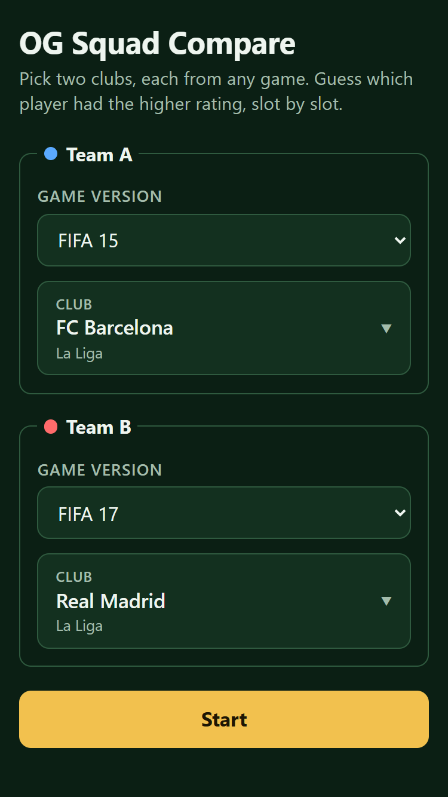
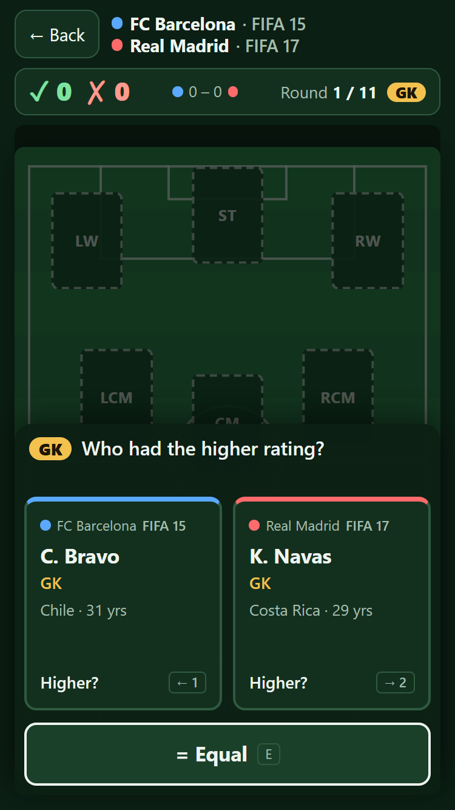
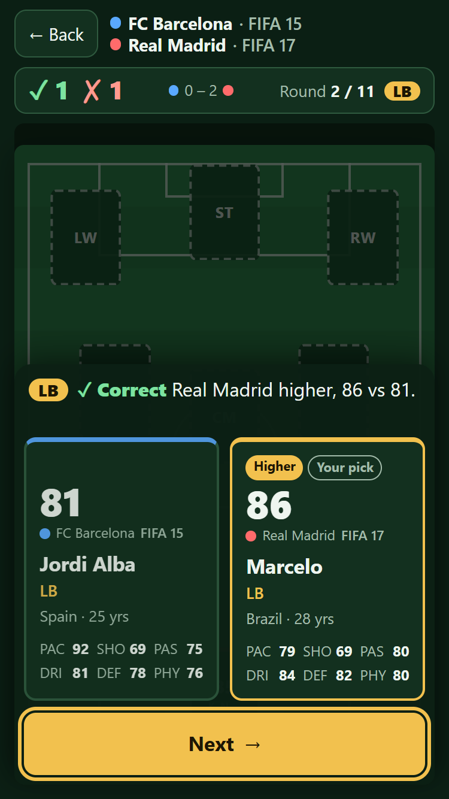
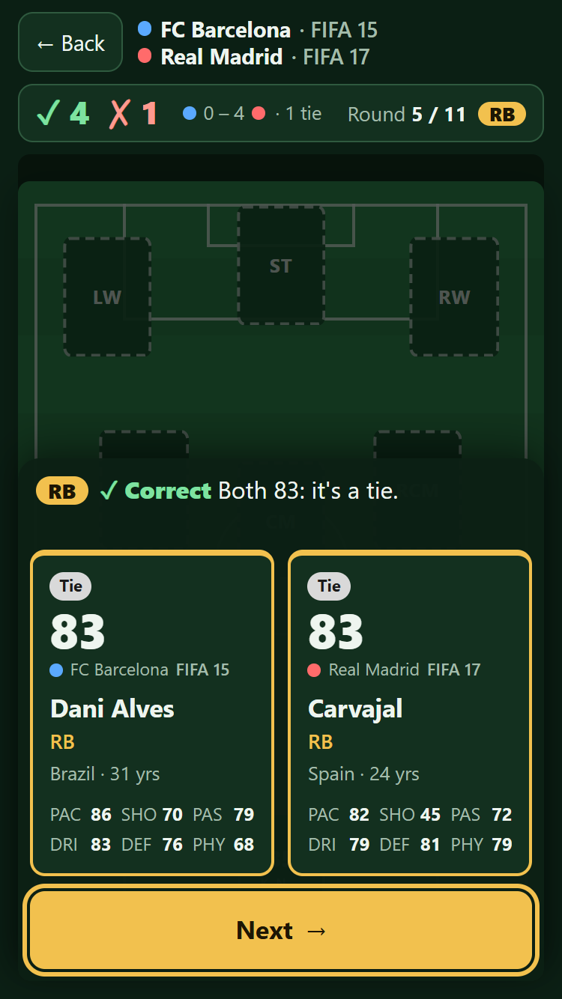
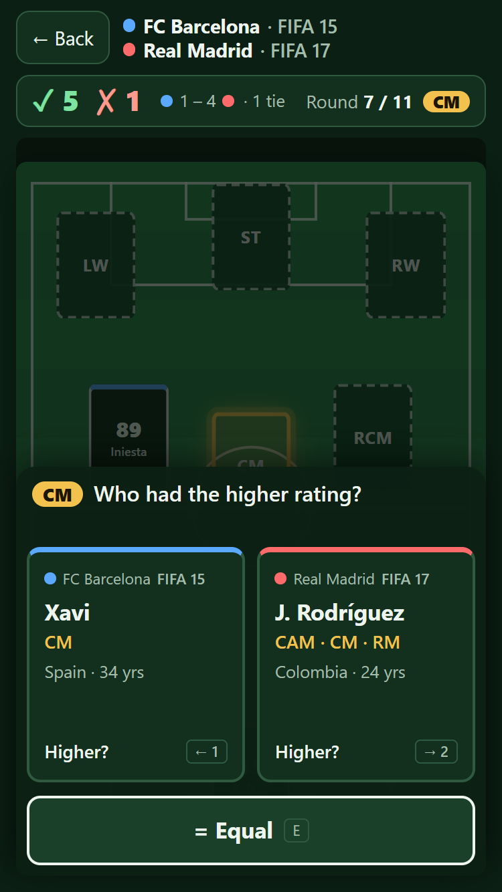
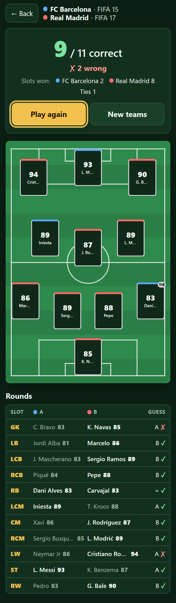
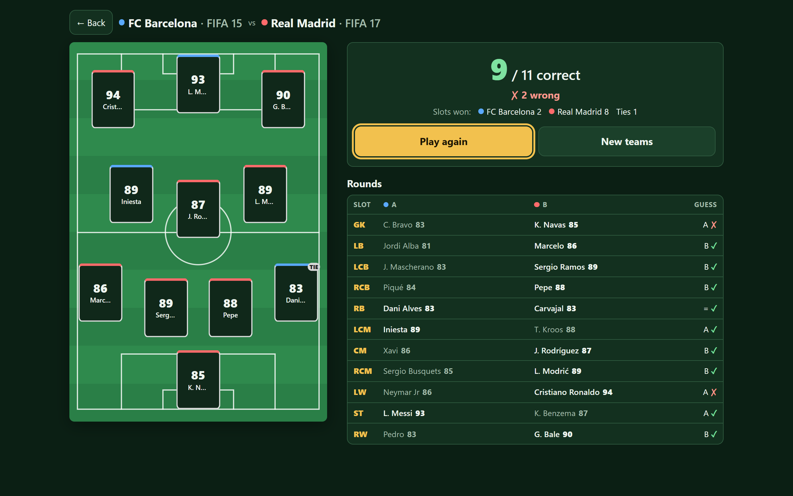

# Stage 05 report — Game loop + per-team version

## What was done

1. **Planning docs** (`CLAUDE.md`, `docs/PLAN.md`, `docs/DECISIONS.md` D30–D36, this prompt) were committed as-is in
   `5b1fe7b` before any code changes.
2. **Setup screen, per-team version (D30).**
   - Each team has its own fieldset: "Team A" and "Team B", each with a colour dot, a "Game version" select and a
     "Club" picker. Both versions default to the newest.
   - Changing a team's version clears only that team's club.
   - A club is disabled on the other side only when both sides use the same version. The Playwright run confirmed
     that FC Barcelona FIFA 15 vs FC Barcelona FIFA 17 can start.
   - Each side loads its own `teams.json` through the existing per-version cache, so two different files load in
     parallel.
3. **Game logic** (`app/src/game/game.ts`) is pure TypeScript with no React.
   - `createGame(xiA, xiB)` builds 11 rounds in D8 order and pairs the two players by `slot` (not by array index).
   - `gameReducer` has three actions:
     - `guess` moves `guessing` to `revealed`;
     - `next` moves `revealed` to the next round's `guessing`, or to `finished` after round 11;
     - `restart` starts round 1 again with the same teams.
     Actions that don't fit the current phase return the same state object.
   - Each round result stores guess, correct answer, `correct`, `winner` and `tie`. On a tie the winner is Team A,
     with `tie: true` (D32).
   - Derived values:
     - `getScore` gives correct, wrong (main score, D33), and slots won by A, slots won by B, and ties;
     - `placedResults` gives what is already on the pitch; a revealed round is placed only after Next (D36);
     - `currentRound`, `currentResult` and `roundNumber` give the round on screen.
   - Helpers: `game/sides.ts` (`GameSide`, short version label "EA SPORTS FC 24" → "FC 24", team label) and
     `game/placed.ts` (the winner cards for the pitch).
4. **Game screen**
   - **Header:** Back, and both teams with a colour dot and version ("FC Barcelona · FIFA 15"). The teams are on two
     lines on phones and one line on desktop.
   - **Scoreboard:**
     - The main score is large: **✓ n** in green and **✗ m** in red.
     - The slot tally is smaller: "● a – b ●" with the team colours, plus "· n tie(s)".
     - "Round n / 11" appears with the slot chip.
   - **Team colours** (blue `#5aa9ff` for A, red `#ff6b6b` for B) are used only for dots, card top borders and
     mini-card top borders.
   - **Guessing (D35):**
     - On phones (< 52 rem), the guess panel is an overlay over the dimmed pitch. It is a solid sheet anchored to
       the bottom, so the cards, Equal and Next are in thumb reach.
     - On desktop, the same component sits in a 25 rem column next to the pitch.
     - Tapping a card guesses that team, and **= Equal** is a full-width button below the cards.
     - Keyboard: Left or 1 guesses A, Right or 2 guesses B, E or = guesses Equal, and Enter or Space goes to Next.
       Key hints appear only on devices with a fine pointer.
   - **Hidden card (D31)** shows name, positions, nation, club and version, and age. The rating and stats markup
     lives only in the `revealed` branch of `PlayerCard`, so it is not in the DOM before the reveal. The Playwright
     run checked this for all 11 rounds.
   - **Revealed:**
     - Both cards show `ovr` and the six stats (PAC/SHO/PAS/DRI/DEF/PHY, or DIV/HAN/KIC/REF/SPD/POS for GKs).
     - The higher card gets a gold border and a "Higher" badge, and the picked card gets "Your pick". On a tie,
       both get "Tie".
     - A result line reads "✓ Correct / ✗ Wrong — Real Madrid higher, 86 vs 81." or "Both 83: it's a tie."
     - Next becomes "See results" in round 11 and gets focus, so Enter continues.
   - **Pitch:** after Next, the slot shows a mini card with the winner's `ovr`, name, a team-colour top border and a
     "TIE" tag when relevant. Filled slots stay for the rest of the game.
   - **Card component:** `PlayerCard` is one component with `state: 'hidden' | 'revealed'`, text-only, ready for
     stage 06 restyling.
5. **End screen (D34)**
   - It shows a large "**9** / 11 correct", "✗ 2 wrong", and "Slots won: ● FC Barcelona 2 ● Real Madrid 8, Ties 1".
   - Below that are the combined XI on the pitch with all 11 filled, and a round list with slot, both players with
     `ovr` (the higher one in bold), the guess (A / B / =) and ✓ or ✗.
   - "Play again" restarts with the same teams. "New teams" returns to setup with both versions kept and both
     clubs cleared.
   - The end screen scrolls on phones. On desktop, the pitch sits on the left with the summary and rounds on the
     right.
6. **Tests:** 31 Vitest tests, all passing. The new `game/game.test.ts` has 18 tests covering:
   - correct and wrong results for all three guesses, against answers A, B and equal;
   - tie placement (Team A plus the tie flag) and round order, with players looked up by slot from a reversed XI;
   - placing on the pitch only after Next, and ignoring actions in the wrong phase;
   - finishing after 11 rounds, score derivation and restart.

## Files

Created in `app/src/`:
- `game/game.ts`, `game/game.test.ts`, `game/sides.ts`, `game/placed.ts`
- `components/PlayerCard.tsx` and `.module.css`
- `components/GuessPanel.tsx` and `.module.css`
- `components/GameHeader.tsx` and `.module.css`
- `components/EndScreen.tsx` and `.module.css`

Changed in `app/src/`:
- `App.tsx`: per-team picks, two `useTeams` calls, and New teams handling.
- `components/SetupScreen.tsx` and `.module.css`: a fieldset per team.
- `components/ClubPicker.tsx`: split into a visible `label` and an accessible `owner`.
- `components/GameScreen.tsx` and `.module.css`: reducer, keyboard, scoreboard and layout.
- `components/Pitch.tsx` and `.module.css`: placed mini cards.
- `index.css`: team colour and success tokens.

Also created: `docs/reports/05-game-loop.md` and `docs/reports/05-screens/*.png`.
Deleted: none.

## How to run

```bash
cd app
npm install
npm run dev        # http://localhost:5173
npm test           # 31 tests
npm run lint
npm run build
npm run preview    # http://localhost:4173
```

## Verification

- `npm run build`, `npm run lint` (0 warnings) and `npm test` (31/31) all pass.
- **Automated full game.** A Playwright script (`playwright-core` with the installed Edge, in a scratch folder,
  not in the repo) played FC Barcelona FIFA 15 vs Real Madrid FIFA 17 at 375×667 through `npm run preview`.
  All **57 checks passed**:
  - **Setup:**
    - the same club in the same version is disabled, and the same club in different versions is allowed;
    - a version change clears only that team's club;
    - there is no horizontal scroll.
  - **Every round:**
    - the hidden panel contains no stat labels, no rating label and neither player's `ovr` value;
    - after the reveal, the rating is shown with a correct or wrong line;
    - after Next, focus is not on the Equal button.
  - **Input mix:** guesses by card click, Equal button, `1`, `2`, ArrowLeft, ArrowRight and `e`; Next by click and
    by Enter.
  - **Score:** two deliberately wrong guesses gave "9 / 11 correct". The end pitch has 11 filled slots with one
    TIE tag, and there is no horizontal scroll.
  - **Play again** resets to round 1 at 0–0. **New teams** keeps versions 15 and 17 and clears both clubs.
  - There were no console errors.
- **Tie:** this matchup has a natural tie in round 5: RB, Dani Alves 83 vs Carvajal 83.
- **Bug found and fixed during the run:** React reused the same `<button>` DOM node when Next turned into Equal, so
  keyboard focus carried into the next round. A second Enter or Space would have guessed "Equal" without the player
  meaning to. Separate `key`s on the two buttons fix it, and the run checks it every round.

### Screenshots (`docs/reports/05-screens/`)

| Setup, two versions (375) | Hidden round (375) | Revealed round (375) |
|---|---|---|
|  |  |  |

| Tie round (375) | Hidden, mid-game with placed cards (375) | End screen (375) |
|---|---|---|
|  |  |  |

End screen at 1280 px: 

Also saved: `round-hidden-1280.png` and `round-revealed-1280.png` (the desktop panel next to the pitch).

## Open issues

1. **During a round the phone overlay hides most of the pitch.** The lower half is covered by the sheet, and the rest
   is dimmed. Placed cards are visible dimly, and fully between games and on the end screen. D35 asks for this, but
   a player can't look at the pitch mid-game. A "peek" toggle, or a short delay after Next, could come in stage 06
   with the "fly to slot" animation.
2. **Back abandons the current game.** Returning to setup and pressing Start starts a fresh game, even with the same
   teams. There is no "are you sure?" prompt.
3. **Mini-card names are heavily truncated** on phones: slots are about 60 px wide, so "Cristiano Ronaldo" becomes
   "Crist…". `ovr` is always readable. Stage 06 could use a shorter display name, such as the last name.
4. **Card heights differ.** A player with a long name or three positions makes one card taller; the grid stretches
   both cards in a row to match.
5. **Keyboard focus after Next falls to `<body>`.** The number and letter shortcuts still work. Tab users start
   again from the top of the page, so focus could move to the first card instead.
6. **Pressing Enter on a focused hidden card** is the same as tapping it, which is the native button behaviour and
   intended. Enter and Space are only "Next" in the revealed phase.

## Assumptions not in the prompt

- In compact places (the game header, cards and the version inside a team label) the version shows as "FC 24"
  instead of "EA SPORTS FC 24". The setup select still shows the full label.
- The secondary tally counts ties separately. The Team A player still fills the slot on a tie (D32), but that slot
  is counted as "tie", not as won by A.
- The scoreboard counts a revealed round immediately, so ✓/✗ updates on the reveal, not on Next. The pitch mini card
  appears on Next (D36).
- "New teams" clears both clubs, since the point is to choose new teams, and keeps both versions as the prompt asks.
  "Back" keeps both clubs.
- The phone layout is used below 52 rem (832 px), the same breakpoint as stage 04.
- A card shows "Your pick" only when the guess was that team, so there is no pick badge after an "Equal" guess.
  The result line covers that case.
- The hidden-card leak check skips a rating that equals one of the players' ages, because it compares text. This did
  not apply in this matchup.
