# Stage 06 report — Card design, flags, animations and polish

## What was done

The planning docs (`docs/PLAN.md`, `docs/DECISIONS.md` D37–D41, this prompt) were committed as-is in `fbabbc2`
before any code changes. **Game logic is unchanged:** `app/src/game/game.ts` is untouched. The only edit to
`game.test.ts` adds the new `nationCode` field to the test fixture, which the type requires. All 18 logic tests
pass unchanged.

### 1. Flags (D39)

- **Pipeline:**
  - `pipeline/nations.py` holds an explicit `NATION_CODES` table. It covers all **141** nations that occur in any
    top-5 squad, which includes the 108 that appear in XIs, so a future change to XI selection cannot hit an
    unmapped nation.
  - Codes are lowercase ISO 3166-1 alpha-2 as used by `flag-icons`, plus `gb-eng`, `gb-sct`, `gb-wls`, `gb-nir`
    and `xk`.
  - `build.py` adds `nationCode` to every XI player through `nation_code()`, which raises `UnknownNationError`
    for an unknown nation, so the build fails loudly.
  - `validate.py` now requires `nationCode` and checks its format.
  - All 10 versions were rebuilt; each file grew by about 6 KB (FC 24: 273 KB).
- **Pipeline tests** (`pipeline/tests/test_nations.py`, 5 tests) check:
  - the code format, the home nations, Kosovo and Côte d'Ivoire;
  - that every code is unique;
  - that an unknown nation raises;
  - that **every code has an SVG in `app/node_modules/flag-icons`**. This one is skipped if the app's
    dependencies aren't installed.
- **App:**
  - `flag-icons` 7.5.0 (MIT) is a dependency. `src/lib/flags.ts` loads its 4×3 SVGs with `import.meta.glob`
    as URLs, so they are bundled locally with no CDN.
  - `vite.config.ts` stops Vite inlining those SVGs as base64. Each of the 271 flags is its own small asset,
    fetched only when shown (`loading="lazy"`).
  - `<Flag>` shows the flag, with the nation name as visible text, or as alt text and tooltip where there is
    no room.
  - A Vitest test checks that every `nationCode` in the generated data resolves to a bundled flag.

### 2. Player card: one component, three states (D5, D37, D38)

`PlayerCard` takes `state: 'hidden' | 'revealed' | 'mini'`. The design is original: rounded card, diagonal sheen,
initials avatar, and a team-colour strip along the top edge.

- **Tiers** (`src/lib/cards.ts` `tierFor`) are bronze ≤ 64, silver 65–74 and gold ≥ 75. Each has its own
  gradient, ink and line palette, used only on revealed and mini cards.
- **Hidden:**
  - A neutral graphite frame with no tier colour (D38).
  - It shows a "?" where the rating goes, an initials avatar (D22), name, positions, flag and nation, a team dot
    with club and short version, and age.
  - It ends with "Higher?", plus a key hint on devices with a fine pointer.
  - It is a `<button>`, and tapping it guesses that team.
  - The revealed face is **mounted only after the guess**, so the rating, stats and tier classes are not in the
    DOM before the reveal (D31). The Playwright run checks this every round.
- **Revealed:**
  - A tier-coloured card with a big `ovr` and the slot position under it, the initials avatar, name, and flag
    with club and version.
  - A badge row: "Higher" or "Tie", plus "Your pick".
  - Six stats in two columns: PAC/SHO/PAS | DRI/DEF/PHY, or DIV/HAN/KIC | REF/SPD/POS for GKs.
  - The higher card, or both cards on a tie, gets a gold glow ring; the lower card is slightly desaturated.
- **Mini (pitch slot):**
  - Tier gradient, `ovr`, a team-colour cap and a "TIE" tag.
  - The name uses `displayName()`, which drops leading initials ("L. Messi" → "Messi", "M. ter Stegen" →
    "ter Stegen"). It can wrap to two lines with a smaller font.
  - The end-screen check confirms all 11 names fit without clipping, e.g. "Alex Sandro", "Lichtsteiner" and
    "Mandžukić".
- **Name helpers** (`displayName`, `initials`) and `tierFor` are unit-tested (`src/lib/cards.test.ts`).

### 3. Animations (all respect `prefers-reduced-motion`)

- **Reveal:** a 400 ms 3D card flip. Both faces share one grid cell inside a persistent flipper, and the hidden
  face becomes `inert` and `disabled` once flipped.
- **After Next:**
  - `src/lib/motion.ts` `flyInto()` clones the winning card's revealed face (Team A's on a tie) into a fixed
    layer. A Web Animations keyframe path of 500 ms shrinks it into its slot on the pitch.
  - While it flies, the guess panel fades out and is `inert`.
  - When the flight ends, the game dispatches `next`: the mini card appears in the slot with a 250 ms pop, and the
    next round's panel slides in.
  - If motion is reduced, or the elements can't be found, it moves to the next round at once.
- **End screen:** the summary fades up and the big number pops in (about 0.6 s).
- **Reduced motion:** every CSS animation and transition has a `prefers-reduced-motion: reduce` override, and
  `flyInto` resolves at once. The Playwright run confirms no flight happens and the next round appears at once.

### 4. UX fixes from stage 05

- **Phone peek:**
  - A small "Pitch" button in the guess panel slides the sheet away and removes the dimming. The whole pitch is
    then visible, with a big "▲ Show cards" button at the bottom to bring the sheet back.
  - Guessing by keyboard or starting the next round closes the peek.
  - The button is hidden on desktop, where the panel already sits next to the pitch.
- **Back confirmation (D41):**
  - On the game screen, Back opens an in-app `ConfirmDialog` built on the native modal `<dialog>`. It traps
    focus, and Escape or a click on the backdrop cancels.
  - "Keep playing" is first and focused; "Leave game" goes back to setup.
  - Game shortcuts are ignored while the dialog is open.
  - The end screen's Back has no confirmation, and the setup screen has no Back.
- **Focus between rounds:**
  - The guess panel is keyed by round, so each round gets fresh DOM; the Next and Equal buttons keep their
    separate keys.
  - During a flight the panel is `inert`, and the keyboard handler ignores input while flying.
  - The run checks after every Next that focus is not on the Equal button.
- **Scoreboard on narrow phones:** at "10 – 0 · 1 tie" the ✓/✗ score used to wrap onto two lines. The main score
  is now `nowrap`, and below 25 rem the word "Round" is hidden visually but still read by screen readers.

## Files

Created:
- `pipeline/nations.py` and `pipeline/tests/test_nations.py`
- `app/src/components/Flag.tsx` and `.module.css`
- `app/src/components/ConfirmDialog.tsx` and `.module.css`
- `app/src/lib/cards.ts` and `cards.test.ts`
- `app/src/lib/flags.ts` and `flags.test.ts`
- `app/src/lib/motion.ts`
- `docs/reports/06-card-design.md` and `docs/reports/06-screens/*.png`

Changed:
- **Pipeline:** `pipeline/build.py` (`nationCode`) and `pipeline/validate.py` (`nationCode` check).
- **Data:** `app/public/data/*/teams.json` (rebuilt with `nationCode`).
- **App config:** `app/package.json` and `package-lock.json` (`flag-icons`), and `app/vite.config.ts` (flags
  are never inlined).
- **App source:**
  - `app/src/data/types.ts`: the `nationCode` type.
  - `app/src/game/placed.ts`: a `PlacedCard` now carries its `GameSide`.
  - `app/src/game/game.test.ts`: the fixture field.
  - `components/PlayerCard.tsx` and `.module.css`: rewritten with three states.
  - `components/GuessPanel.tsx` and `.module.css`: flip, peek, flight, entrance.
  - `components/GameScreen.tsx` and `.module.css`: flight orchestration, peek, confirm dialog, scoreboard fix.
  - `components/Pitch.tsx` and `.module.css`: mini `PlayerCard` and `data-slot`.
  - `components/EndScreen.module.css`: entrance.

Deleted: none.

## How to run

```bash
# Pipeline (from the repo root)
pipeline/.venv/Scripts/python -m pytest pipeline/tests -q     # 19 passed
pipeline/.venv/Scripts/python pipeline/build.py
pipeline/.venv/Scripts/python pipeline/validate.py            # OK: all checks passed

# App
cd app
npm install
npm test          # 37 passed
npm run lint      # 0 warnings
npm run build
npm run dev       # or: npm run preview
```

## Verification

- `pytest` (19), `validate.py`, `npm run build`, `npm run lint` and `npm test` (37) all pass.
- **Playwright full game:** `playwright-core` with the installed Edge, in a scratch folder, not in the repo.
  It played Juventus FIFA 16 vs Salernitana FIFA 22 against `npm run preview`, and **all 89 checks passed**.
  This matchup gives gold vs silver (e.g. LB 82 vs 73), gold vs bronze (RW 82 vs 64), a GK round (84 vs 73) and a
  natural tie (LW: Asamoah 79 vs Ribéry 79).
- **Every round** at 375×667 with animations on, the run checked that:
  - the hidden cards contain no stat labels, rating label, back face, tier class or either `ovr` value;
  - flags are shown;
  - after the flip, both faces have the expected tier for their `ovr`;
  - after Next, focus is not on Equal, the flight clone is removed, and exactly *n* mini cards are on the pitch.
- **Also checked:**
  - A flight clone exists mid-animation.
  - Peek hides the cards, and "Show cards" brings them back.
  - The Back dialog ignores the `1` key; Keep playing closes it and stays in round 7.
  - The main score stays on one line in round 11.
  - The end score reads "9 / 11 correct" (two deliberately wrong guesses), and all 11 mini names fit.
  - There is no horizontal scroll, and the end-screen Back has no dialog.
  - There were no console errors.
- **1280 px:** a full game by keyboard, Play again, then Back and "Leave game" returns to setup.
- **Reduced motion** (a separate context with `reducedMotion: 'reduce'`): no flight clone, and the next round
  appears at once.

### Screenshots (`docs/reports/06-screens/`, 375 px unless noted)

| Hidden round | Revealed: gold vs silver | GK round revealed |
|---|---|---|
| 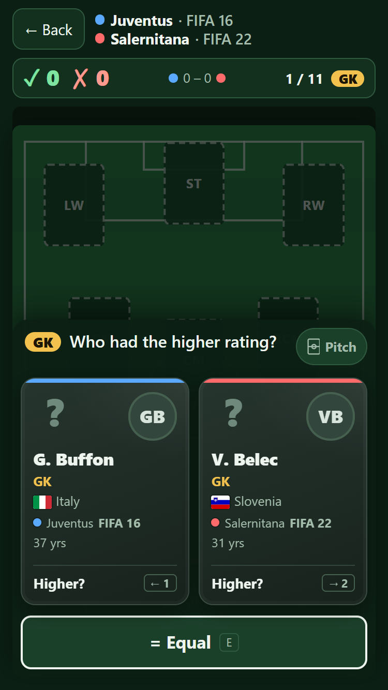 | 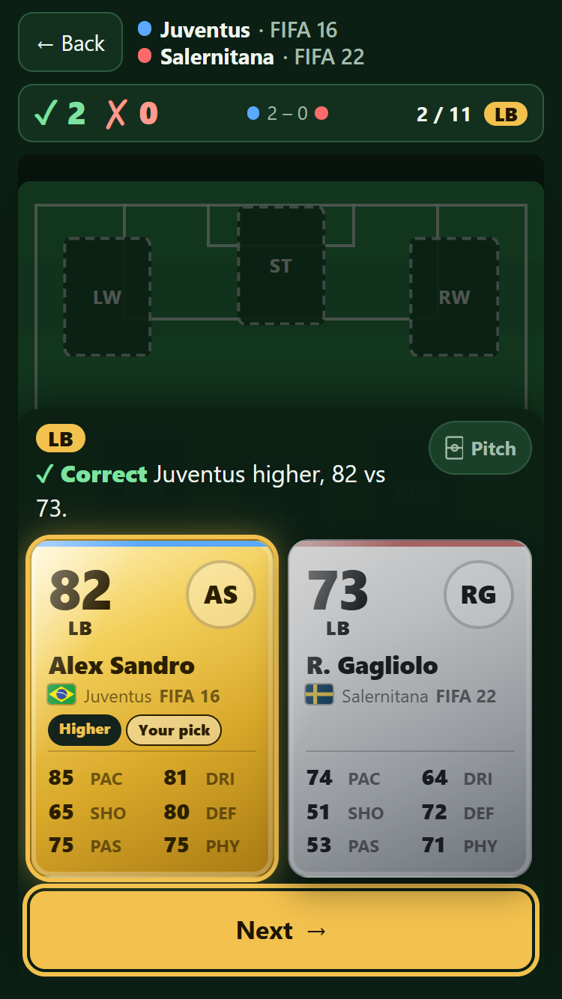 | 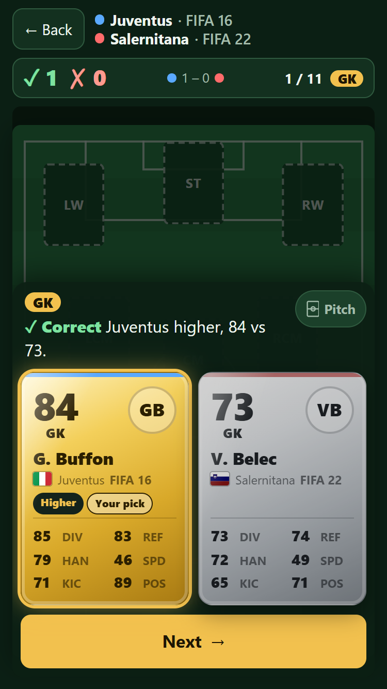 |

| Tie round | Back confirmation | Peek |
|---|---|---|
| 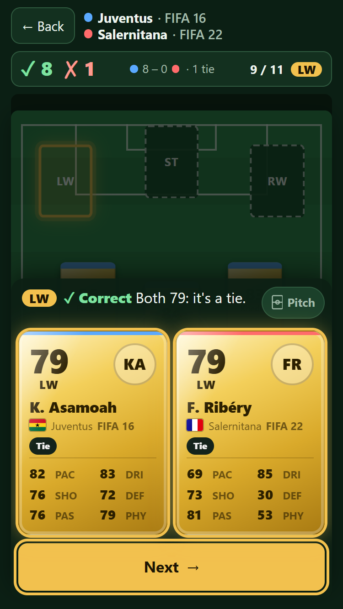 | 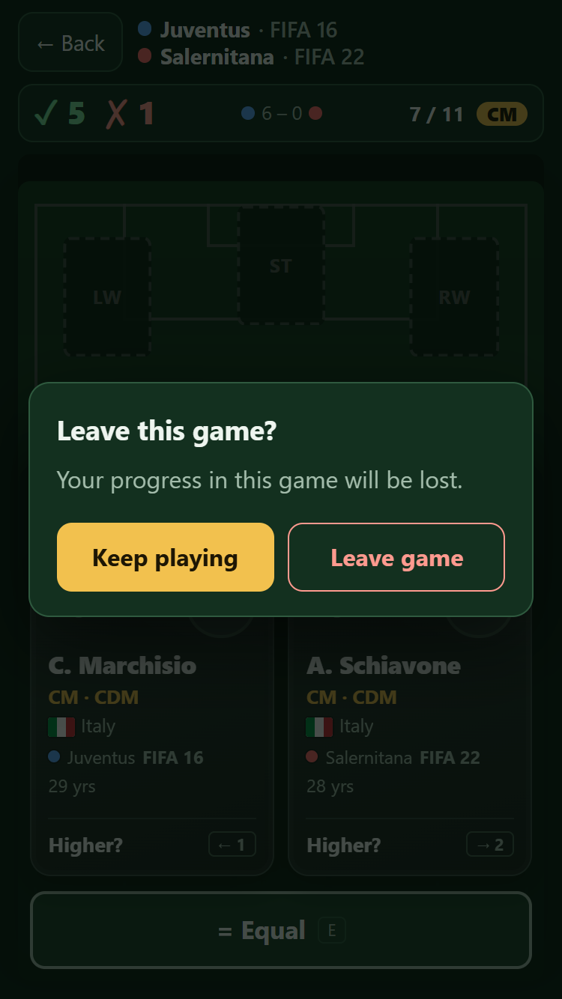 | 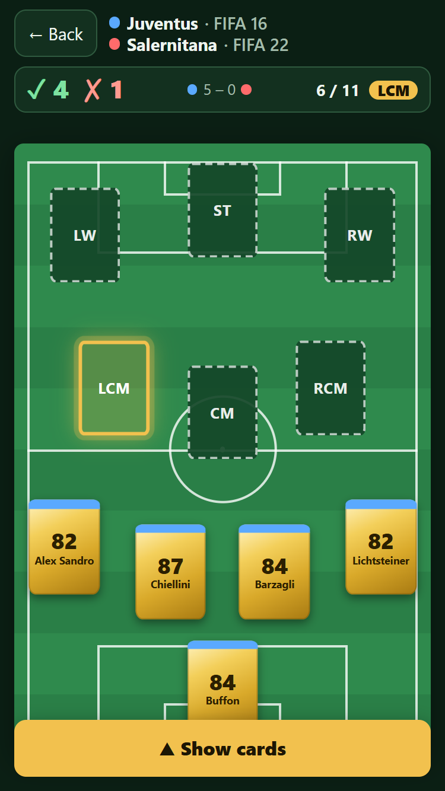 |

| Card flying into its slot | Revealed: gold vs bronze | End screen |
|---|---|---|
| 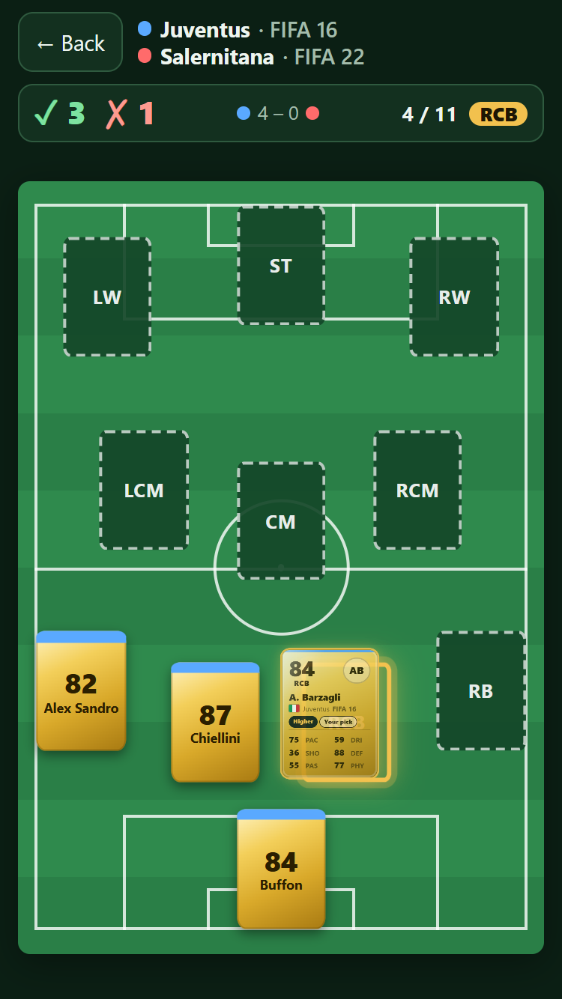 | 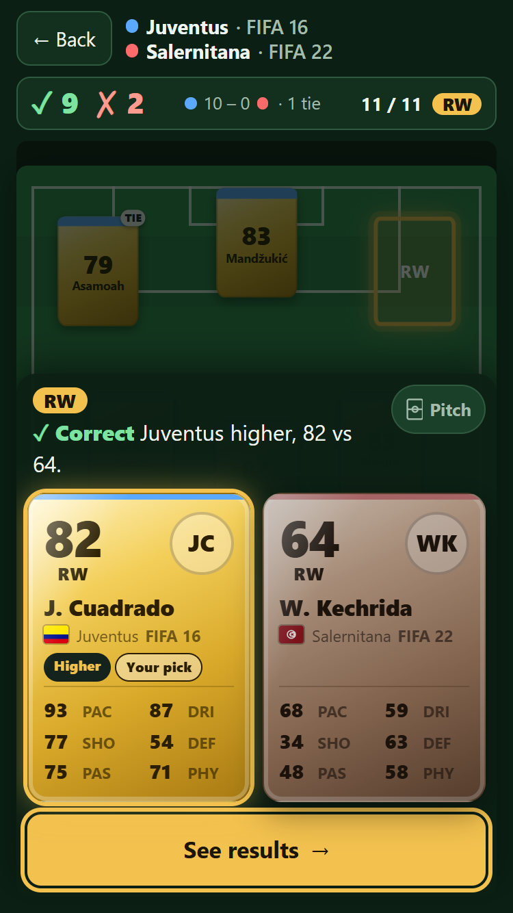 | 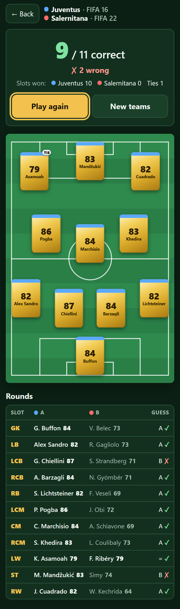 |

1280 px: 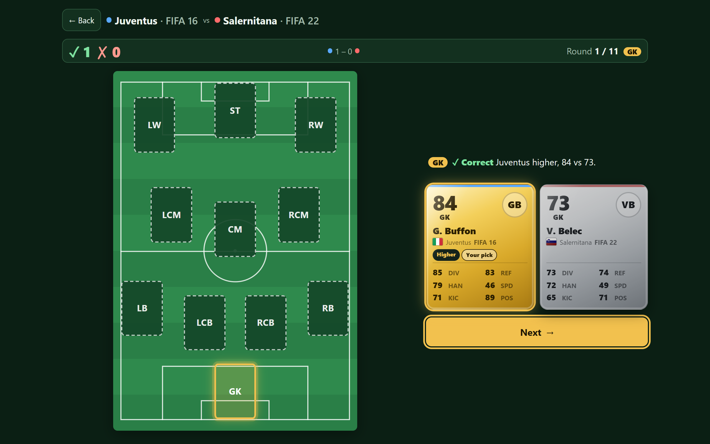 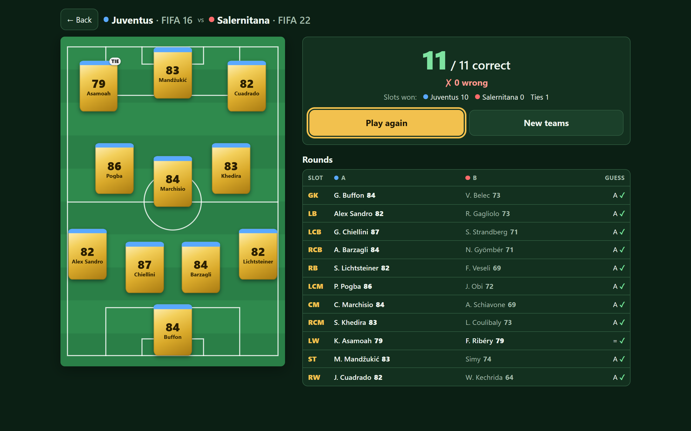

## Open issues

1. **The build output is 5.5 MB.** That is about 2.7 MB of team data plus 271 flag SVGs (a few KB each). Only the
   flags on screen are downloaded, so page weight per game stays small, but the deploy uploads them all. If this
   matters for stage 07, the glob could be limited to the 141 codes in `nations.py`.
2. **Initials avatars** use the short name. Very short or single-word names give two letters of the same word,
   e.g. "Rodri" → "RO". This is acceptable, but it could use the full name for single-word short names.
3. **Rendering differences:** the flip uses `preserve-3d` and `backface-visibility`, which I tested in Chromium
   (Edge) only. Safari usually handles this well, but I haven't checked it. The fly animation uses the Web
   Animations API, and falls back to an instant move if it's missing.
4. **Revealed cards on phones are about 230 px tall.** With a two-line result message, the sheet covers most of
   the pitch while revealed. The peek button still works in the revealed state.
5. **The stage 02 report's size table is out of date** (about 250 KB per version). With `nationCode` the files are
   about 256–273 KB (FC 24: 273 KB).

## Assumptions not in the prompt

- `nations.py` covers every nation in top-5 squads, not only XI players, so the build can't break if the XI
  selection changes.
- **Initials and display name** both come from `short_name`:
  - initials are the first letter of the first word plus the first capitalised later word, so particles like
    "ter" are skipped;
  - the display name drops leading "X. " initials only.
- The revealed card shows the **slot** (e.g. "RB") under the rating, as the prompt asks, not the player's first
  position.
- On a revealed card, the team is identified by the colour strip on top; the team dot is hidden there to leave
  room for the club name.
- **The winner card flies**, and on a tie Team A's card flies, matching D32. The loser card fades out with the
  panel.
- **Peek** is phone-only (< 52 rem), and a guess or Next closes it.
- **The Back dialog** focuses "Keep playing" by default, so a stray Enter doesn't end the game. A click on the
  backdrop cancels.
- The end-screen "Play again" button still gets initial focus, as in stage 05.
